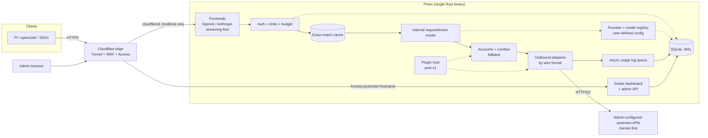

# Prism: Multi-Protocol LLM Proxy

## Metadata
- **Author:** Project owner
- **Created:** 2026-09-19
- **Status:** Draft (requirements phase), revision 3: OpenAI and Anthropic inbound only (streaming first), accounts and combos with fallback
- **Approvers:** none yet

## Objective
Give a small team one self-hosted endpoint that speaks the OpenAI Chat Completions and Anthropic Messages formats (streaming first), forwards requests to upstream LLM APIs that the admin configures by hand (Gemini first), and adds virtual keys, account combinations with automatic fallback, cost tracking, and caching on top.

## Background
The team wants to use Gemini models from tools that expect other API formats, most immediately [Pi](https://pi.dev) (a terminal coding agent that can talk to OpenAI-, Anthropic-, and Google-compatible endpoints via a configurable base URL). Today that means handing out raw Gemini API keys, which gives no per-person limits, no spend visibility, no failover when a key is rate-limited, and no way to revoke one person without rotating the key for everyone.

Prism is a single Rust service, deployed on a separate machine and exposed through a Cloudflare Tunnel, that sits between clients and the upstream LLM APIs (Gemini first). Clients get virtual keys. The upstream Gemini keys never leave the server. A Svelte dashboard (embedded in the same binary) manages keys, shows usage and cost, and lets admins inspect traffic.

Prism ships **no provider templates or presets**. Every upstream is defined by the admin: endpoint URL, credentials, wire format, models, capabilities, parameters, and prices. Gemini is the first upstream used for development and acceptance testing, but it is configured the same way as any other. Later, a plugin system will let users add integrations that cannot be expressed as static configuration (for example account-based logins for other services). v1 does not include a plugin runtime, but its internal boundaries (see FR-11) are designed so plugins can attach without rewrites.

## Related documents
- Pi custom provider docs: <https://pi.dev/docs/latest/custom-provider>
- Test plan: not yet written (see the fixture suite in FR-9 and Milestone 2)

## Goals
- Team members and tools (Pi first) use Gemini (or any other configured upstream) through standard OpenAI or Anthropic client configuration by changing only base URL and key.
- Every request is attributable to a person or project, with token counts and cost.
- One rate-limited, quota-exhausted, or failing account does not cause visible failures for clients: accounts can be combined so traffic falls back automatically.
- The proxy adds negligible latency and memory overhead compared with calling Gemini directly, including on long streaming sessions.
- An admin can issue, limit, and revoke access in seconds without touching upstream keys.
- Safe to expose on the public internet through a tunnel, with a small team as the only intended users.
- Any LLM API that speaks a supported wire format can be added by an admin through configuration alone, with only the essentials required (endpoint, credential, wire format, model ID) and everything else optional.
- New kinds of integrations (for example account-based logins for other services) can be added later as plugins without rewriting the core.

## Non-goals
- **Multi-tenant SaaS.** No billing, self-signup, or hard isolation between mutually distrustful customers. Users are a trusted small team.
- **Bundled provider templates, presets, or price lists.** Prism does not ship knowledge of specific vendors' endpoints, models, or prices. This avoids stale data and hidden assumptions. The cost is more up-front configuration, softened by optional model discovery (FR-10.4) and user-authored export/import (FR-10.12).
- **A plugin runtime in v1.** Plugins (for example Claude or ChatGPT account integrations) are planned, but v1 only guarantees the extension seams (FR-11.1, FR-11.2), not a working plugin host.
- **Guessing capabilities.** Discovery may import what an endpoint reports (IDs, and limits if provided), but Prism does not infer capabilities such as vision or reasoning that it was not told about.
- **Gemini-native or other inbound formats.** Clients speak OpenAI Chat Completions or Anthropic Messages only. Gemini and any other format are upstream-only wire formats.
- **Non-streaming as a first-class path.** Streaming is the primary path and the one optimized and tested first. Non-streaming requests are supported only as a thin fallback (FR-1.4).
- **Semantic caching.** Only exact-match caching. Semantic matching risks returning wrong answers, and the payoff is unproven for this workload.
- **Perfect fidelity for every provider-specific feature.** Features with no equivalent across formats (see FR-8) may be dropped with a clear error or warning rather than emulated.
- **High availability.** One instance on one machine. No clustering or multi-region.
- **Prompt management, evals, or agent orchestration.** Prism moves and measures requests; it does not build them.

## Scenarios

**Scenario A: Developer runs Pi against Gemini**
1. Admin creates a virtual key `sk-prism-...` for Alice in the dashboard, allows models `gemini-*`, and sets a monthly budget. The full key is shown once.
2. Alice configures Pi with Prism's base URL and her key, using Pi's OpenAI-compatible (or Anthropic) provider type.
3. Pi requests the model list from Prism, then starts a session. Prism translates each request to Gemini, streams the response back in the format Pi expects (including tool calls), and records tokens and cost against Alice's key.
4. Mid-session, one upstream Gemini key returns 429. Prism retries on another pool key before any bytes reach Pi. Alice sees no error.

**Scenario B: Every account in a combo is unavailable**
1. All targets of the requested combo are in cooldown or exhausted.
2. Prism returns a protocol-correct 429/503 with `Retry-After` to the client and raises an alert to the admin.
3. When the first account recovers (cooldown ends or quota resets), traffic resumes with no restart.

**Scenario C: Admin investigates a cost spike**
1. Admin opens the dashboard and sees that Bob's key used 5x its usual tokens yesterday.
2. Admin filters by key and tag, opens individual request metadata (model, tokens, latency, cache status), and sets a lower daily cap.
3. Bob's next request over the cap gets a clear 429 with a budget-exceeded message.

**Scenario D: Leaked key**
1. A virtual key is pasted into a public repo.
2. Admin revokes it. All subsequent requests with that key fail within seconds. No upstream key changes.

**Scenario E: Admin adds an upstream by hand**
1. Admin opens Providers → Add. Enters a name, base URL, wire format (OpenAI-compatible, Anthropic, or Gemini), the auth scheme, and one or more API keys. Nothing is pre-filled.
2. Admin clicks "Fetch models". Prism calls the provider's model-list endpoint with the key and shows what came back (IDs, plus limits if reported). Admin picks which to import.
3. For each imported model the admin optionally sets capabilities (text, vision, reasoning), context window, max output, which parameters are supported (for example a temperature range), a thinking-level mapping, and prices. Anything left blank is simply not sent or not assumed.
4. Admin sends a test request from the dashboard and sees the upstream's status and a redacted error if it fails.
5. The model now appears in `/v1/models` for virtual keys allowed to use it, with its configured capabilities and limits.

**Scenario F (post-v1): Admin installs an account-integration plugin**
1. Admin installs a plugin that provides an account-based login for some service and reviews the permissions it requests.
2. The plugin registers a new credential strategy or provider type. The admin configures it in the same Providers screen as any other upstream.
3. Requests through it get the same virtual keys, limits, budgets, logging, cost tracking, and failover as built-in providers. The plugin cannot see other providers' credentials or call the admin API beyond what it declared.

**Scenario G: A combo falls back when a quota runs out**
1. Admin has three accounts: a free-tier Gemini key with a soft daily cap the admin set, a paid Gemini key, and an account on an OpenAI-compatible provider. Admin creates a combo `coder` in priority order: free Gemini, paid Gemini, then the other provider, each with the model to use there.
2. Pi requests the model `coder`. Prism sends the request to the first account.
3. The free key reports quota exhausted. Prism marks it exhausted until its reset time (taken from the response, or from the admin's reset schedule) and retries on the paid key before any bytes reach Pi. Alice sees nothing.
4. Later the paid key is rate-limited for 30 seconds. Prism moves to the third account, translating the request to that provider's format and mapping the model and parameters. Any target that cannot satisfy the request (for example, images are attached but the model is not configured for vision) is skipped.
5. The next day the free key's quota resets and it becomes the first choice again. The dashboard shows which account served each request and how many fallback hops occurred.

## Diagrams

The diagram shows two public hostnames through the same tunnel: the API hostname (virtual-key auth) and the admin hostname (Cloudflare Access). Usage logging is off the request path. The registry holds every provider, credential, and model definition the admin has entered; nothing about specific vendors is built in. The plugin host is dotted because it is post-v1: it attaches to the same credential and adapter seams that built-in code uses.

## Glossary
- **Virtual key:** A Prism-issued credential (`sk-prism-...`) given to a user or tool. Maps to limits and attribution. Distinct from upstream keys.
- **Upstream key:** A real provider API key held by Prism, never exposed to clients.
- **Account:** One credential for one provider (an API key now; a login session via plugins later), with its own health, cooldown, and optional soft quota. The unit that gets rate-limited or exhausted.
- **Key pool:** The accounts of one provider that Prism rotates across.
- **Combo:** A named list of (account, model) targets with a selection strategy and fallback policy. Clients address a combo like any model name, and it may span providers.
- **Frontend:** The inbound API surface in one wire format. Only OpenAI Chat Completions and Anthropic Messages are offered.
- **Wire format:** The API dialect an endpoint speaks. Inbound (clients to Prism): OpenAI or Anthropic only. Outbound (Prism to upstreams): OpenAI-compatible, Anthropic, or Gemini.
- **Adapter:** The outbound integration for one wire format. Chosen by the provider's configured wire format, not by vendor, so translation cost grows with the number of formats rather than the number of providers.
- **Provider (config):** An admin-defined upstream: name, base URL, wire format, auth scheme, credentials, optional extra headers, and its models.
- **Model (config):** An admin-defined entry under a provider: upstream model ID plus optional capabilities, limits, supported parameters, thinking-level mapping, and prices.
- **Model discovery:** Optional fetch of a provider's model list (using its credentials) to pre-populate model configs.
- **Capability:** A declared feature of a model, such as text, vision, reasoning, or tool calling.
- **Thinking level:** Prism's canonical scale for reasoning effort, mapped per model to whatever fields the upstream expects.
- **Credential strategy:** The component that supplies and refreshes the credentials for a provider: a static API key, or (via plugins) a login session or rotating token.
- **Plugin:** A post-v1 installable extension that adds credential strategies, providers, or hooks.
- **Internal model:** The provider-neutral request and streaming-event types every frontend decodes into and every adapter consumes.
- **Passthrough path:** When the client wire format equals the upstream wire format (for example Anthropic in, Anthropic out), forward the body with minimal parsing.
- **Alias:** A stable model name clients use (e.g. `fast`) mapped to a real upstream model or to a combo.
- **Pi:** An open-source terminal coding agent; the first target client.

## Constraints
- **Language and shape:** Rust backend, Svelte frontend, shipped as one binary (dashboard assets embedded).
- **Hosting:** One machine, reached only via Cloudflare Tunnel. No inbound ports open.
- **Cloudflare behavior:** Proxied connections idle for about 100 seconds are dropped (HTTP 524), so long silent thinking phases need SSE keepalives.
- **Upstream:** Whatever the admin configures, each under its own vendor's terms and quotas. Gemini is the only provider used for acceptance testing at launch.
- **No presets:** No default endpoints, model lists, capability guesses, or prices are shipped. All are admin-supplied, so a minimal working config must need only endpoint, wire format, credential, and model ID.
- **Team size:** Small trusted team (order of 5 to 20 people). Optimize for operational simplicity over horizontal scale.
- **Budget:** No paid managed services required beyond Cloudflare and Gemini usage.

## Functional requirements

Priority: **MUST** = required for the phase listed; **SHOULD** = planned but can slip; **MAY** = optional. Phases refer to the Timeline.

### FR-1 Inbound API surfaces
| ID | Requirement | Priority | Phase |
|---|---|---|---|
| FR-1.1 | Serve OpenAI Chat Completions (`POST /v1/chat/completions`) with streaming (SSE) as the primary path. | MUST | 1 |
| FR-1.2 | Serve `GET /v1/models` returning available models and aliases, including context window and max output tokens where known, so clients like Pi can discover them. | MUST | 1 |
| FR-1.3 | Serve Anthropic Messages (`POST /v1/messages`) with streaming, including `x-api-key` and `anthropic-version` headers. | MUST | 3 |
| FR-1.4 | Non-streaming requests (`stream: false`) are supported as a lower-priority fallback by consuming the upstream stream and aggregating it, so there is one code path. | SHOULD | 2 |
| FR-1.5 | Serve OpenAI Responses API (`/v1/responses`). | MAY | later |
| FR-1.6 | Serve embeddings endpoints. | MAY | later |

### FR-2 Translation and streaming fidelity
| ID | Requirement | Priority | Phase |
|---|---|---|---|
| FR-2.1 | Decode each frontend into one internal request model, and encode internal streaming events back into each frontend's exact wire format (SSE event names, chunk shapes, terminators). | MUST | 1 |
| FR-2.2 | Support system prompts, multi-turn history, sampling parameters, and stop sequences across all frontends. | MUST | 1 |
| FR-2.3 | Support tool/function calling end to end: tool definitions, model tool calls (including parallel calls and incremental argument streaming), and tool results in subsequent turns. | MUST | 1 |
| FR-2.4 | Support image input (base64 and URL where the upstream allows). | SHOULD | 2 |
| FR-2.5 | Map reasoning/thinking controls and surface thinking output where the target format has a place for it; otherwise omit without breaking the stream. Mapping is driven by the model's configured thinking-level map (FR-10.7). | SHOULD | 2 |
| FR-2.6 | Map finish reasons, stop reasons, and usage fields correctly in every format. | MUST | 1 |
| FR-2.7 | Passthrough path whenever inbound and outbound wire formats match (OpenAI-in to an OpenAI-compatible upstream, Anthropic-in to an Anthropic upstream): forward bytes without full re-serialization, extracting only usage metadata. | SHOULD | 3 |
| FR-2.8 | Unsupported features return an explicit, format-correct error naming the feature, never a silent drop that changes behavior (e.g. dropping tool definitions). Cosmetic-only fields may be ignored. What counts as unsupported is decided by the model's configured capabilities and parameters (FR-10.6, FR-10.9), not hardcoded per vendor. | MUST | 1 |
| FR-2.9 | Client disconnect cancels the upstream request promptly so unused tokens are not generated or billed. | MUST | 1 |

### FR-3 Virtual keys and access control
| ID | Requirement | Priority | Phase |
|---|---|---|---|
| FR-3.1 | Admins can create, list, disable, and revoke virtual keys. Full key shown once; only a hash is stored. | MUST | 1 |
| FR-3.2 | Each key has an owner (user or team) and optional free-form tag. | MUST | 1 |
| FR-3.3 | Per-key limits: allowed models, aliases, and combos, requests per minute, tokens per minute, daily and monthly budget (USD), expiry date. | MUST | 2 |
| FR-3.4 | Optional per-key IP allowlist (evaluated against the client IP from Cloudflare headers). | MAY | 4 |
| FR-3.5 | Accept a virtual key in any of the auth styles the frontends use (`Authorization: Bearer` for OpenAI-format clients, `x-api-key` for Anthropic-format clients). | MUST | 3 |
| FR-3.6 | Revocation and limit changes take effect within 5 seconds without restart. | MUST | 2 |
| FR-3.7 | Limit violations return a format-correct 429 with a human-readable reason and `Retry-After` where meaningful. | MUST | 2 |

### FR-4 Upstream key pool and failover
| ID | Requirement | Priority | Phase |
|---|---|---|---|
| FR-4.1 | Maintain a pool of upstream credentials per provider, added and removed from the dashboard, stored encrypted at rest. | MUST | 2 |
| FR-4.2 | Select keys by health-aware strategy (weighted or least-recently-used), skipping keys in cooldown. | MUST | 2 |
| FR-4.3 | On upstream 429, put the key in cooldown (honoring `Retry-After` when present) and retry on another key. | MUST | 2 |
| FR-4.4 | On upstream 5xx or connection failure, retry with backoff on a different key, up to a configurable attempt limit. | MUST | 2 |
| FR-4.5 | **Retries happen only before any response bytes have been sent to the client.** A failure mid-stream terminates the stream with a format-correct error event; it is never silently retried or spliced. | MUST | 2 |
| FR-4.6 | Circuit breaker per key; automatic recovery probing. | SHOULD | 2 |
| FR-4.7 | Fallback across models and providers is expressed as combos (FR-12). Every fallback must be visible in logs and response headers. | MUST | 2 |
| FR-4.8 | Distinguish key-level failures (quota, invalid key) from request-level failures (bad request). Do not retry the latter. | MUST | 2 |

### FR-5 Model aliasing and routing
| ID | Requirement | Priority | Phase |
|---|---|---|---|
| FR-5.1 | Configurable alias table mapping client-facing model names to either a single (provider, model) target or a combo (FR-12). A model is also addressable directly by `provider/model-id`. | MUST | 1 |
| FR-5.2 | Map well-known foreign model names (e.g. names a client hardcodes) to configured Gemini targets. | SHOULD | 3 |
| FR-5.3 | Unknown model names return a format-correct "model not found" error. | MUST | 1 |

### FR-6 Usage, cost, and logging
| ID | Requirement | Priority | Phase |
|---|---|---|---|
| FR-6.1 | Record for every request: timestamp, virtual key, model, frontend format, status, latency, time to first token, input/output/cached/thinking token counts, computed cost, cache status, serving account, combo name and fallback path, retry count. | MUST | 1 |
| FR-6.2 | Extract token usage from streaming responses (final chunk) and non-streaming responses. When usage is missing (e.g. aborted stream), record what is known and flag the row. | MUST | 1 |
| FR-6.3 | Cost computed from per-model prices entered by the admin (none are bundled), including differing rates for cached and thinking tokens. Prices are versioned so past costs stay reproducible. Models with no price configured are logged with tokens only and cost shown as unknown, never as zero; budgets in USD cannot be enforced on them. | MUST | 2 |
| FR-6.4 | Usage logging is asynchronous and batched; it must never block or fail a client request. | MUST | 1 |
| FR-6.5 | Request/response body logging is off by default and opt-in per key, with redaction rules and a short retention. | SHOULD | 4 |
| FR-6.6 | Budget alerts (webhook to Slack/Discord) at configurable thresholds (e.g. 80%, 100%). | SHOULD | 4 |
| FR-6.7 | Audit log of admin actions (key created/revoked, limits changed, pool changed). | MUST | 2 |

### FR-7 Caching
| ID | Requirement | Priority | Phase |
|---|---|---|---|
| FR-7.1 | Exact-match response cache keyed on a hash of the normalized request (model, messages, parameters). | SHOULD | 4 |
| FR-7.2 | Only cache when the request is deterministic (e.g. temperature 0) or the key/request opts in. Never cache error responses. | SHOULD | 4 |
| FR-7.3 | Cache is scoped per virtual key or team by default; cross-key sharing is an explicit setting. | SHOULD | 4 |
| FR-7.4 | Cached streaming responses replay as a stream in the client's format. | SHOULD | 4 |
| FR-7.5 | Configurable TTL and size bound; admin can purge. Cache hits are visible in logs and via a response header. | SHOULD | 4 |
| FR-7.6 | Track and pass through Gemini's own context-caching token accounting so cost reflects discounted cached tokens (see Open issue on caching value). | SHOULD | 2 |

### FR-8 Admin dashboard and admin API
| ID | Requirement | Priority | Phase |
|---|---|---|---|
| FR-8.1 | Svelte dashboard, embedded in the binary, served from a separate admin hostname/route group. | MUST | 2 |
| FR-8.2 | Screens: keys (create/limit/revoke), upstream pool health, usage and cost over time (by key, model, tag), request log with filters, providers and models editor with discovery and test request (FR-10), accounts and combos editor (FR-12), alias table. | MUST | 2 |
| FR-8.3 | Live view of in-flight and recent requests with status, latency, and token counts. | SHOULD | 4 |
| FR-8.4 | Every dashboard action is also available through a documented admin HTTP API (the dashboard is a client of it). | MUST | 2 |
| FR-8.5 | Config that must survive restarts lives in the database or a config file, editable without recompiling. | MUST | 1 |

### FR-9 Compatibility verification
| ID | Requirement | Priority | Phase |
|---|---|---|---|
| FR-9.1 | A fixture suite of recorded real request/response pairs (plain chat, streaming, tool calls, parallel tools, images, errors) replayed through every frontend to Gemini and back, run in CI. | MUST | 2 |
| FR-9.2 | Acceptance test: a Pi session (multi-turn, with tool use and streaming) completes successfully through each supported format. | MUST | 1 (OpenAI), 3 (Anthropic) |
| FR-9.3 | Compatibility notes documenting per-client config (Pi, opencode, official SDKs) checked into the repo. | SHOULD | 3 |

### FR-10 Provider and model configuration
Principle: no templates. The only required inputs are endpoint, wire format, credential, and model ID. Every other setting is optional, and **unset means "not sent" or "not assumed"**, never a hidden vendor default.

| ID | Requirement | Priority | Phase |
|---|---|---|---|
| FR-10.1 | Provider config: name, base URL, wire format (`openai`, `anthropic`, `gemini`), auth scheme (bearer header, custom header name, or query parameter), one or more credentials, optional static extra headers, optional timeouts. | MUST | 1 |
| FR-10.2 | Model config, minimal: upstream model ID, display name, enabled flag. | MUST | 1 |
| FR-10.3 | Model config, optional metadata: capabilities (text, vision, reasoning, tool calling, and an extensible list for others such as audio), context window, max output tokens, per-token prices (input, output, cached, thinking). | MUST | 2 |
| FR-10.4 | Model discovery: for a provider, the admin can trigger a fetch of the model list using its credentials. The list endpoint path and response mapping default by wire format and are overridable per provider. Discovered models are imported only when the admin selects them. | MUST | 2 |
| FR-10.5 | Discovery is configurable: manual only, or scheduled refresh. It never overwrites fields the admin has edited (per-field override tracking). Models that vanish upstream are flagged, not deleted. Limits reported by the endpoint are stored as suggested values the admin can accept. | SHOULD | 2 |
| FR-10.6 | Generation parameters per model (temperature, top_p, top_k, max output tokens, stop sequences, seed, penalties, and others): the admin can mark each supported or unsupported, set a range and default, and choose the policy for a client value that is unsupported or out of range: `drop`, `clamp`, or `reject`. Parameters not configured are forwarded unchanged. | MUST | 2 |
| FR-10.7 | Thinking per model: a canonical level scale (for example off, low, medium, high, plus an optional numeric budget) and an admin-defined mapping from each level to the upstream's request fields. Client-native controls (such as an effort string or a token budget) are normalized to the canonical scale on the way in. Models with no thinking config get no thinking fields added. | MUST | 2 |
| FR-10.8 | Extra request fields: per provider or model, static JSON to merge into upstream request bodies (`set-if-absent` or `override`) for vendor features Prism does not model. Unknown client fields are configurable as `forward` or `strip`. | SHOULD | 2 |
| FR-10.9 | Capability enforcement mode per provider: `permissive` (default; capabilities are advisory and requests are forwarded) or `strict` (a request using a capability the model is not configured for, such as image input to a non-vision model, is rejected per FR-2.8). | MUST | 2 |
| FR-10.10 | Model listing endpoints in every frontend format reflect each model's configured capabilities, context window, and max tokens using that format's conventions, and only for models the calling virtual key may use. | MUST | 2 |
| FR-10.11 | Connectivity test: from the dashboard, the admin can send a test request or minimal probe to any provider or model and see the upstream status and a redacted error. | MUST | 2 |
| FR-10.12 | Export and import of the provider/model configuration as a file, secrets excluded or encrypted. This is the only template mechanism and it is user-authored. | SHOULD | 4 |
| FR-10.13 | Configuration edits are validated before applying, audited, and take effect without restart. In-flight requests finish with the config snapshot they started with. | MUST | 2 |
| FR-10.14 | Because endpoints are user-supplied, outbound requests (including discovery) are subject to the guardrails in NFR-3.9. | MUST | 1 |

### FR-11 Extensibility and plugins
The plugin host is post-v1, but the seams below must exist in v1 so it can be added without rewrites.

| ID | Requirement | Priority | Phase |
|---|---|---|---|
| FR-11.1 | Internal interfaces for (a) outbound adapter (per wire format), (b) credential strategy (how a request gets authorized: static key, login session, rotating token), (c) model source (how models are listed), and (d) request/response hooks. Built-in code implements these same interfaces; nothing built in bypasses them. | MUST | 1 |
| FR-11.2 | Credential strategies can refresh, expire, and rotate credentials and report health to the key pool the same way static keys do. | MUST | 2 |
| FR-11.3 | Plugin host: install, enable, disable, and remove plugins from the dashboard. Each plugin has a manifest declaring name, version, provided components, and requested permissions. | SHOULD | 5 |
| FR-11.4 | Plugins run isolated from the core with only declared permissions (network hosts, which providers' credentials, storage namespace). By default they cannot read other providers' credentials or call the admin API. | MUST (when FR-11.3 ships) | 5 |
| FR-11.5 | Plugin-provided providers appear in the same registry and get the same virtual keys, limits, budgets, logging, cost tracking, and failover as built-in ones, and can be members of combos (FR-12). | MUST (when FR-11.3 ships) | 5 |
| FR-11.6 | Install from a local file or URL with hash verification and version pinning. No central marketplace is in scope. | SHOULD | 5 |

Intended plugin targets (not built here): account-based integrations for Claude, ChatGPT, and similar services. See Legal considerations before building any.

### FR-12 Accounts and combos
An **account** is one credential for one provider. A **combo** groups accounts (optionally across providers) under one name with a selection strategy and a fallback policy. Clients address a combo like any model name (through an alias or directly). Plugin-provided accounts, such as login-based ones, take part exactly like API-key accounts.

| ID | Requirement | Priority | Phase |
|---|---|---|---|
| FR-12.1 | Each account has a status (healthy, cooling down, exhausted, disabled), an optional label, optional weight or priority, and an optional soft quota (FR-12.5). | MUST | 2 |
| FR-12.2 | A combo is a named list of targets, each target being an account (or a provider's whole pool), a model, and optional parameter overrides. Selection strategy per combo: `priority` (ordered fallback), `round-robin`, `weighted`, or `least-used`. | MUST | 2 |
| FR-12.3 | Fallback triggers, configurable per combo: upstream rate limit (429), quota exhaustion, 5xx or connection failure, and timeout. Errors caused by the request itself (invalid request, unsupported feature) never trigger fallback. | MUST | 2 |
| FR-12.4 | Rate limit and quota exhaustion are distinguished. A **rate limit** puts the account in a short cooldown, honoring `Retry-After` or a configured default. **Quota exhaustion** marks the account exhausted until its reset time, taken from the response when available, otherwise from an admin-configured schedule (daily at a set time, monthly, or rolling window), or until manually reset. The rules that classify a response as one or the other (status codes, error codes, message patterns) are configurable per provider, because vendors report these differently. | MUST | 2 |
| FR-12.5 | Soft quotas: per-account caps (requests, tokens, or USD, per day, month, or rolling window) that Prism enforces itself, marking the account exhausted when reached. Useful when a vendor does not report quotas clearly. | SHOULD | 2 |
| FR-12.6 | Return to preferred: when a higher-priority account recovers, it becomes preferred again automatically. Recovery uses a single probe request so a recovering account is not hit by a burst. | MUST | 2 |
| FR-12.7 | Cross-provider targets: a combo may mix providers and wire formats. Each attempt is translated to the target's format and mapped to its model, configured parameters, and thinking settings. | MUST | 3 |
| FR-12.8 | Compatibility filtering: before trying a target, skip targets whose configured capabilities or limits cannot satisfy the request (images without vision, input larger than the context window, tools required but not supported). Unconfigured metadata counts as compatible, consistent with the permissive default (FR-10.9). | SHOULD | 3 |
| FR-12.9 | All fallback happens before the first response byte (FR-4.5). If every target is unavailable, return a format-correct 429 or 503 naming the combo, with `Retry-After` set to the soonest expected recovery. | MUST | 2 |
| FR-12.10 | Conversation continuity: when a mid-conversation request falls back to a different provider or model, content only the original provider can interpret (for example Anthropic thinking blocks with their signatures, provider-specific tool call IDs) is converted or stripped so the request stays valid. Policy per combo: `strip`, `convert`, or `error`. | MUST | 3 |
| FR-12.11 | Dashboard shows per-account status, next recovery time, quota use against cap, and per-combo fallback counts. Responses carry `X-Prism-Served-By` naming the serving target, which can be hidden from clients. | MUST | 2 |
| FR-12.12 | Usage and cost are attributed to the virtual key and, separately, to the serving account, so spend per account is visible. | MUST | 2 |
| FR-12.13 | Alerts when a combo's primary target becomes exhausted, when all targets of a combo are unavailable, and when the fallback rate exceeds a threshold. | SHOULD | 4 |
| FR-12.14 | Sticky routing (optional): keep a session (identified by a configurable header or conversation hash) on the same target while it is healthy, to preserve upstream prompt-cache benefits and avoid mid-session provider switches. Stickiness breaks only on fallback triggers. | MAY | 4 |
| FR-12.15 | A virtual key can restrict which providers or accounts may serve it, so sensitive traffic never falls back to a provider the admin has not approved for it. | SHOULD | 3 |

## Non-functional requirements

### NFR-1 Performance and efficiency (SLO targets)
Initial targets, to be validated by benchmark in Milestone 2 and revised with data.

| ID | Requirement | Target |
|---|---|---|
| NFR-1.1 | Added latency, non-streaming, cache miss (Prism processing only, excluding upstream time) | p50 ≤ 5 ms, p99 ≤ 25 ms |
| NFR-1.2 | Added time-to-first-token on streams | p50 ≤ 10 ms, p99 ≤ 50 ms |
| NFR-1.3 | Streaming pass-through | Chunks forwarded as they arrive; no buffering of whole responses; per-stream memory bounded (target ≤ 256 KB) |
| NFR-1.4 | Concurrency | 200 concurrent streams and 50 requests/sec sustained on 1 vCPU / 512 MB |
| NFR-1.5 | Idle footprint | ≤ 50 MB RSS, negligible CPU |
| NFR-1.6 | Cold start | Ready to serve in ≤ 2 s |
| NFR-1.7 | Logging overhead | No measurable effect on request latency (async queue; bounded, drops or spills rather than blocks) |

### NFR-2 Reliability
| ID | Requirement | Target |
|---|---|---|
| NFR-2.1 | Availability attributable to Prism (excludes Gemini and Cloudflare outages) | 99.5% monthly |
| NFR-2.2 | Auto-restart on crash via process supervisor | Recovery ≤ 10 s |
| NFR-2.3 | Graceful shutdown drains in-flight streams up to a configurable timeout | Default 30 s |
| NFR-2.4 | Data safety | SQLite WAL; automated backup of the database on a schedule; restore procedure documented |
| NFR-2.5 | Connection idle keepalive | SSE keepalive comments during silent periods so streams survive the Cloudflare idle timeout |
| NFR-2.6 | Degradation | If the database is unavailable, keep serving with cached key state and buffer usage logs in memory (bounded); fail closed only for admin operations |
| NFR-2.7 | Fallback bounds | Max attempts per request configurable (default: number of targets, capped at 5); total pre-first-byte deadline default 30 s; cooldown and exhaustion state changes take effect within 1 s |

### NFR-3 Security
| ID | Requirement |
|---|---|
| NFR-3.1 | Listen on localhost only; `cloudflared` is the sole ingress. Real client IP read from Cloudflare headers, trusted only because of this. |
| NFR-3.2 | Admin dashboard and admin API are on a separate hostname protected by Cloudflare Access, and Prism additionally validates the Access JWT (defense in depth). Virtual API keys can never call admin endpoints. |
| NFR-3.3 | Virtual keys: high-entropy, stored as SHA-256 (or stronger) hashes, compared in constant time, shown once. |
| NFR-3.4 | Upstream keys encrypted at rest with a master key supplied via environment or file outside the database; never returned by any API or written to logs. |
| NFR-3.5 | Secrets, Authorization headers, and upstream keys are redacted from all logs and error messages. |
| NFR-3.6 | Request size limits and per-key/per-IP rate limits protect against abuse; unauthenticated requests are cheap to reject. |
| NFR-3.7 | Minimal dependencies, `cargo audit`/`cargo deny` in CI, pinned lockfile. |
| NFR-3.8 | Client-facing error messages never leak upstream key IDs, internal hostnames, or raw upstream error bodies containing secrets. |
| NFR-3.9 | User-supplied endpoints and discovery URLs are validated: HTTPS by default; loopback, link-local, private ranges, and cloud metadata addresses are blocked unless the admin explicitly allows a specific host; redirects are not followed across hosts; resolved IPs are re-checked at connect time to prevent DNS rebinding. |
| NFR-3.10 | Credentials in provider configs are write-only through the admin API (never returned) and are sent only to that provider's configured host. |

### NFR-4 Observability
| ID | Requirement |
|---|---|
| NFR-4.1 | Structured logs (JSON) via `tracing`, with a request ID propagated to the client in a response header and to upstream calls. |
| NFR-4.2 | Prometheus-format metrics endpoint (admin-only): request rate, error rate by class, latency and TTFT histograms, active streams, per-key-pool health, cache hit ratio, log queue depth. |
| NFR-4.3 | Alerts for: all pool keys in cooldown, error rate above threshold, log queue near capacity, database write failures, budget thresholds. |

### NFR-5 Maintainability and extensibility
| ID | Requirement |
|---|---|
| NFR-5.1 | Frontends and adapters are separated by the internal model. Adding a provider that uses a supported wire format is configuration only (no rebuild, no code); adding a new wire format or a plugin must not require editing any frontend. |
| NFR-5.2 | Deployable as a single binary plus a config file; no runtime other than the OS. |
| NFR-5.3 | Configuration changes for providers, models, aliases, prices, and limits do not require a rebuild or restart. |
| NFR-5.4 | Schema migrations are versioned and run automatically at startup, with a pre-migration backup. |
| NFR-5.5 | Translation code is covered by the fixture suite (FR-9.1); a change that alters wire output fails CI. |

### NFR-6 Usability and operability
| ID | Requirement |
|---|---|
| NFR-6.1 | A new team member can be onboarded (key issued, Pi configured) in under 5 minutes from documented steps. |
| NFR-6.2 | Error messages returned to clients explain what happened and what to do (e.g. "monthly budget exceeded, resets on the 1st"). |
| NFR-6.3 | Dashboard is usable on a laptop and a phone-sized screen for quick revocation. |

### NFR-7 Portability and compatibility
| ID | Requirement |
|---|---|
| NFR-7.1 | Runs on Linux x86_64 and aarch64; builds reproducibly in CI. |
| NFR-7.2 | Wire compatibility is defined by the fixture suite and Pi acceptance tests, not by reading specs alone. |

### NFR-8 Extension safety (applies once plugins ship)
| ID | Requirement |
|---|---|
| NFR-8.1 | Plugins are untrusted by default and run behind an isolation boundary (sandbox or separate process) with capabilities granted explicitly. |
| NFR-8.2 | A crashing, hanging, or slow plugin cannot crash the core or stall unrelated providers: enforced timeouts, resource limits, and a per-plugin circuit breaker. |
| NFR-8.3 | The plugin interface is versioned; the core refuses plugins built for an incompatible major version. |
| NFR-8.4 | Per-call overhead of each plugin is measured and shown in the dashboard; native adapters keep the NFR-1 targets regardless of plugins installed. |
| NFR-8.5 | Plugin actions on credentials and requests are audit-logged, and plugin logs are namespaced and redacted the same way as core logs. |

## Monitoring / alerting
- Alert (Slack/Discord webhook) if **all targets of a combo are unavailable** (cooldown or exhausted) for more than 1 minute, and when a combo's primary account is first marked exhausted.
- Alert if 5xx rate attributable to Prism or upstream exceeds 5% over 5 minutes.
- Alert if p95 added latency exceeds 100 ms for 10 minutes.
- Alert if the usage-log queue exceeds 80% capacity or any write fails.
- Alert when a virtual key crosses 80% and 100% of budget.
- Alert if the nightly database backup fails.
- Alert if a provider's credential strategy fails to refresh, or a scheduled model discovery fails repeatedly.
- Uptime probe from outside (e.g. Cloudflare health check) on a lightweight `/healthz` route that checks the process and database.

## Timeline
- **Milestone 1: Walking skeleton.** Pi, configured with an OpenAI-compatible provider pointing at Prism, holds a streaming multi-turn conversation with Gemini including a tool call. Gemini is defined through the same provider/model config used for any upstream (minimal fields only: URL, wire format, key, model ID), loaded from a config file. Virtual keys via config file, usage rows written to SQLite.
- **Milestone 2: Operable service.** Provider and model configuration in the dashboard (manual entry, model discovery, parameter, thinking, and capability settings, test request), accounts and combos with rate-limit and quota fallback (within one provider), per-key limits and budgets, cost tracking from per-model prices, audit log, dashboard v1 (keys, providers, pool health, usage), extension seams (FR-11.1, FR-11.2) in place, fixture suite in CI, first benchmark against NFR-1 targets.
- **Milestone 3: Anthropic frontend and cross-provider combos.** Anthropic Messages frontend, with passthrough for OpenAI-to-OpenAI-compatible and Anthropic-to-Anthropic upstreams. Pi verified against the Anthropic format. Cross-provider combos with capability filtering and conversation-continuity handling. Alias mapping for foreign model names. OpenAI-compatible outbound adapter (pending the Open issue on outbound scope). Per-client setup docs.
- **Milestone 4: Polish.** Response cache, budget alerts, live request view, Prometheus metrics, optional body logging with redaction, sticky routing, config export/import.
- **Milestone 5: Plugins (post-v1).** Plugin host, manifest and permission model, hash-pinned install, and one reference plugin (a credential-strategy plugin) that proves the seams.

Dates are intentionally left out until the translation fixture suite gives a real read on effort for Milestone 1 and 3.

## Interfaces

**Public API (virtual-key auth):**
- `POST /v1/chat/completions` (OpenAI)
- `GET /v1/models`
- `POST /v1/messages` (Anthropic)
- `GET /healthz`

**Admin API (Cloudflare Access + JWT validation, separate hostname):**
- `/admin/keys` (virtual keys), `/admin/providers` (providers, credentials and pool, models, discovery, test requests, config export/import), `/admin/accounts` and `/admin/combos` (see FR-12), `/admin/aliases`, `/admin/usage`, `/admin/requests`, `/admin/audit`, `/admin/plugins` (post-v1), `/metrics`

**Response headers added by Prism:** `X-Request-Id`, `X-Prism-Cache: hit|miss|bypass`, `X-Prism-Fallback` (when a fallback target was used), and `X-Prism-Served-By` (serving target, can be hidden).

**Example Pi configuration (illustrative; exact fields per Pi docs):** a provider entry with `baseUrl` set to Prism's API hostname, `apiKey` set to the virtual key, `api: "openai-completions"`, and a model list matching the aliases Prism exposes.

## Dependencies / infrastructure
- **Language/runtime:** Rust, Tokio.
- **HTTP server:** Axum. **HTTP client:** `reqwest` with rustls and HTTP/2 connection pooling.
- **Storage:** SQLite in WAL mode via `sqlx`. Chosen for operational simplicity on a single machine; migration to Postgres is possible because access goes through `sqlx`.
- **Caching:** `moka` (in-memory) with optional disk/SQLite second tier.
- **Rate limiting:** `governor` or equivalent token-bucket implementation.
- **Frontend:** SvelteKit built as static assets, embedded with `rust-embed`.
- **Ingress:** `cloudflared` tunnel plus Cloudflare Access for the admin hostname.
- **Process supervision:** systemd (or container restart policy).
- **Plugin runtime (post-v1, undecided):** candidates are out-of-process plugins over local HTTP or stdio, WebAssembly (for example `wasmtime`), or an embedded scripting language. See Open issues.

Hard-to-reverse choices in this list: Rust, the internal model shape, the SQLite schema for usage and keys, the provider/model config schema, and the plugin interface once third parties depend on it.

## Security
**Trust boundaries:** Internet → Cloudflare → localhost tunnel → Prism → Gemini. Prism holds the only copy of upstream keys and is the enforcement point for all per-user limits.

**Threats considered:**
- *Stolen or leaked virtual key.* Mitigated by hashed storage, instant revocation, budgets, per-key rate limits, optional IP allowlist, and usage alerts.
- *Public exposure of the admin surface.* Mitigated by separate hostname, Cloudflare Access, JWT validation in Prism, and no admin routes on the API hostname.
- *Upstream key theft from the host.* Mitigated by encryption at rest with an externally supplied master key, least-privilege OS user, no key material in logs or API responses.
- *Cache poisoning / cross-user leakage via shared cache.* Mitigated by per-key cache scoping by default (FR-7.3).
- *Abuse / denial of wallet.* Mitigated by budgets, rate limits, body size limits, and Cloudflare WAF rules as a coarse outer layer.
- *Header spoofing (client IP).* Only trusted because the port is not reachable except via the tunnel.
- *Malicious or malformed upstream/client payloads.* Strict deserialization, size limits, bounded buffers.
- *SSRF through admin-defined endpoints and model discovery.* Because any URL can be entered, a compromised admin session could turn Prism into a pivot into the host's internal network or cloud metadata service. Mitigated by NFR-3.9 (allow-list style blocking of internal ranges, no cross-host redirects, rebinding checks).
- *Malicious or buggy plugins (post-v1).* Mitigated by isolation, declared permissions, hash-pinned installs, and audit logging (NFR-8).
- *Exposure of account-style credentials.* Login sessions and refresh tokens (as opposed to API keys) are broader in power. They get the same encryption at rest as upstream keys, are scoped to the owning plugin and provider, and are never logged.

**Out of scope:** hostile insiders with shell access on the host, and defense against Google-side compromise.

## Privacy
- Prompts and completions from coding agents can contain source code and secrets. Prism therefore **does not store bodies by default** (FR-6.5).
- Metadata (who, when, model, tokens, cost) is retained indefinitely by default for cost history; configurable purge.
- If body logging is enabled for a key, it is time-limited (default 7 days), access-restricted to admins, and redacted for known secret patterns.
- Data sent to each configured provider is subject to that provider's data-use terms, which can differ by tier (for example free versus paid). The team should know the terms behind each configured key before sending proprietary code (see Open issues). Prism does not track this; the provider config may carry an optional free-text note for it.
- Combos can send the same prompt to different vendors depending on availability. Every target in a combo must be acceptable for the traffic that uses it, and virtual keys can restrict which providers may serve them (FR-12.15).

## Legal considerations
- For every configured provider (Gemini first), confirm that pooling and sharing API keys through a proxy among team members is permitted under that vendor's API terms, and that any per-project quota or multi-key usage patterns comply. This is an assumption, not yet verified.
- Prism's source is under the owner's chosen license; dependencies should be limited to permissive licenses (checked by `cargo deny`).
- **Account-integration plugins (future).** Routing team traffic through consumer subscription accounts (a Claude or ChatGPT login rather than an API key) may violate those services' terms, and vendors have restricted this kind of use in the past. Sharing one person's account among several people is the likeliest violation, and account bans are a realistic outcome. I have not verified current terms for any vendor. Design stance: the Prism core ships no such integrations; any plugin for them is user-installed at the user's own responsibility, disabled by default, and shows a visible warning before use.
- **Combining accounts to get around limits.** Using several accounts, especially free tiers, to work around a vendor's per-account limits may violate that vendor's terms. Combos are intended for resilience and cost ordering across accounts the team legitimately holds. I have not verified any vendor's current terms.

## Logging
- **Operational logs (JSON, stdout/journald):** startup, config load, upstream errors, retries, key cooldown transitions, admin actions. Level `info` by default. Retained per host log policy (suggest 30 days).
- **Usage records (SQLite):** per-request metadata as in FR-6.1. Retained indefinitely; purge is configurable.
- **Audit log (SQLite):** admin actions; append-only; retained indefinitely.
- **Never logged:** virtual keys, upstream keys, `Authorization` / `x-api-key` / `x-goog-api-key` headers, `?key=` query values, and (by default) prompt or response bodies.

## Open issues

**Issue: Which inbound format to build first for Pi**
- *What's unresolved:* Pi supports OpenAI-, Anthropic-, and Google-compatible providers. The plan assumes OpenAI Chat Completions first for Milestone 1.
- *Options considered:* (a) OpenAI first: most widely supported, simplest streaming shape. (b) Anthropic first: possibly better fit if Pi's tool/thinking handling is best tested on that path. Gemini-native inbound is out of scope, so that option is gone.
- *Next step:* Run Pi against a stub server in each mode and record what each sends (tools, thinking parameters, streaming options) to confirm (a).

**Issue: Value of response caching for agentic coding workloads**
- *What's unresolved:* Coding agents resend a growing conversation every turn, so exact-match hit rates are likely near zero. Caching may mostly help scripted or repeated deterministic calls.
- *Options considered:* Keep FR-7 at SHOULD/Phase 4 and prioritize cost accounting for Gemini's implicit/explicit context caching (FR-7.6) instead; or drop the local cache.
- *Next step:* After Milestone 2, measure repeat-request rate from real usage logs, then decide.

**Issue: Handling features with no cross-format equivalent**
- *What's unresolved:* Thinking blocks and signatures, Anthropic prompt-caching markers, provider-specific tool types, and safety-setting fields do not map cleanly.
- *Options considered:* Error explicitly, ignore with a response warning header, or emulate.
- *Next step:* Build the compatibility matrix from Pi's actual traffic, then classify each field as required, ignorable, or error (FR-2.8).

**Issue: Gemini key sharing terms and data-use tier**
- *What's unresolved:* Whether pooled key usage is allowed, and whether the keys are on a tier that permits using prompts for product improvement.
- *Options considered:* Use paid-tier keys only for code-related traffic; restrict free-tier keys to non-sensitive use; get explicit clarification from Google's terms.
- *Next step:* Read the current terms and decide the tier policy before onboarding anyone else.

**Issue: Rate-limiting state location**
- *What's unresolved:* In-memory counters are fastest but reset on restart; database-backed counters are durable but slower.
- *Options considered:* In-memory for RPM/TPM (short windows), database-backed for budgets.
- *Next step:* Confirm during Milestone 2 with a restart test.

**Issue: Behavior when Gemini returns partial output then errors**
- *What's unresolved:* How each frontend should surface a mid-stream failure so that Pi and other clients recover cleanly instead of hanging or treating partial output as complete.
- *Options considered:* Format-native error event followed by close, versus abrupt close.
- *Next step:* Test against Pi and official SDKs to see how each reacts.

**Issue: Plugin runtime and isolation model**
- *What's unresolved:* How plugins run and what they can do. This is the hardest-to-reverse choice in the extensibility story, because it becomes a public interface.
- *Options considered:* (a) Out-of-process plugins over local HTTP or stdio: any language, strong isolation, natural fit for OAuth/login helpers, costs an extra hop and process management. (b) WebAssembly (e.g. `wasmtime`): strong sandbox, portable, but streaming and network access across the boundary are awkward. (c) Embedded scripting (Lua, Rhai, JS): quick to write, weaker isolation. (d) Rust dynamic libraries: fastest, but unstable ABI and no isolation.
- *Next step:* Limit the first plugin surface to credential strategies (acquire, refresh, inject headers), since account integrations mostly need that and not new protocol handling. My leaning is out-of-process for that. Prototype one before deciding on plugins that supply full adapters.

**Issue: Canonical thinking-level scale**
- *What's unresolved:* Vendors express reasoning control differently (effort strings, token budgets, levels), and not all models support all levels.
- *Options considered:* A fixed enum (off/low/medium/high) plus optional numeric budget with per-model mapping (current FR-10.7), or pure passthrough with per-model allowed values and no canonical scale.
- *Next step:* Capture the exact reasoning fields Pi sends in each format, then test whether the enum-plus-mapping covers them without lossy conversions.

**Issue: Model discovery response mapping**
- *What's unresolved:* List endpoints differ in path, pagination, field names, and ID formatting (some prefix IDs), and OpenAI-compatible servers vary in what they return.
- *Options considered:* Defaults per wire format plus an admin-editable field mapping; or discovery only for the three known shapes with manual entry as the fallback.
- *Next step:* Implement the per-format defaults with a small override mapping, and test the Gemini list endpoint first.

**Issue: Outbound wire formats in v1**
- *What's unresolved:* Milestone 1 only needs Gemini outbound, but adapters are per wire format, so OpenAI-compatible outbound is cheap when the client is also OpenAI-format (near passthrough), while Anthropic outbound adds a full translation direction.
- *Options considered:* Gemini only through Milestone 2, then OpenAI-compatible in Milestone 3; or all three outbound before v1.
- *Next step:* Decide after Milestone 1, based on how much of the translation layer is reusable.

**Issue: Source of truth for configuration**
- *What's unresolved:* Whether the database or a config file is authoritative for providers and models. The dashboard editor implies the database; export/import (FR-10.12) covers reproducibility.
- *Options considered:* Database authoritative with export/import; file authoritative with a read-only dashboard; both with explicit sync.
- *Next step:* Confirm database-authoritative, and use a file only to bootstrap Milestone 1.

**Issue: Detecting quota exhaustion and its reset time**
- *What's unresolved:* Vendors report rate limits and quotas differently (status codes, error bodies, headers, or not at all), and some free tiers reset on schedules the API never states.
- *Options considered:* Admin-editable classification rules per provider with defaults per wire format; parse reset hints from headers or bodies when present; admin-set reset schedules; Prism-enforced soft quotas (FR-12.5); exponential backoff probing when nothing else is known.
- *Next step:* Capture real 429 and quota-exhausted responses from Gemini (per-minute versus per-day limits) and design the default classifier from them.

**Issue: Conversation continuity across cross-provider fallback**
- *What's unresolved:* Switching providers mid-conversation can invalidate history: thinking blocks and signatures from one vendor are not valid for another, tool call IDs differ, and context windows and tokenization differ.
- *Options considered:* `strip` (drop non-portable content), `convert` (translate where a mapping exists), `error` (refuse), and sticky routing (FR-12.14) to reduce switches.
- *Next step:* Run a Pi session that is forced to fall back mid-conversation in each direction between formats, and see what breaks.

## Resolved issues
None yet.

## Alternatives considered
- **LiteLLM (or a similar existing gateway):** Mature and already speaks many formats. Rejected as the primary path because the goal here includes a lean, efficient, single-binary service the owner fully controls and understands; it remains the benchmark to compare feature and correctness gaps against.
- **Cloudflare AI Gateway in front of Gemini:** Convenient since Cloudflare is already in the path, and offers caching, logging, and rate limiting. As far as I know it does not provide first-class cross-format translation (e.g. an Anthropic-format client to Gemini) or multi-key pooling with per-user virtual keys, so it would not cover the core requirement. Worth re-checking, and possibly usable in front of Prism later.
- **Node/TypeScript or Go implementation:** Faster to prototype and Pi's ecosystem is TypeScript. Rejected in favor of Rust for memory footprint, predictable streaming latency, and single static binary, at the cost of slower iteration on translation code. The fixture suite mitigates that cost.
- **Postgres instead of SQLite:** Better for multi-instance and heavy analytics. Unnecessary for one machine and a small team; revisit if Prism ever needs to run as more than one instance.
- **Pi extension that talks directly to Gemini (no proxy):** Simplest for one user, but gives no shared key management, budgets, failover, or attribution across the team and other tools.
- **Bundled provider templates or presets (one-click "add OpenAI/Anthropic/Gemini"):** Much friendlier onboarding, but Prism would have to maintain vendor endpoints, model lists, and prices that go stale, and vendor assumptions would leak into the core. Rejected by decision. Model discovery and user-authored export/import recover much of the convenience.
- **Providers only as compiled-in code (no plugin system):** Simpler and faster, but every new integration needs a release, and account-style integrations do not belong in the core for legal reasons. Rejected in favor of config-driven providers now and plugins later.
